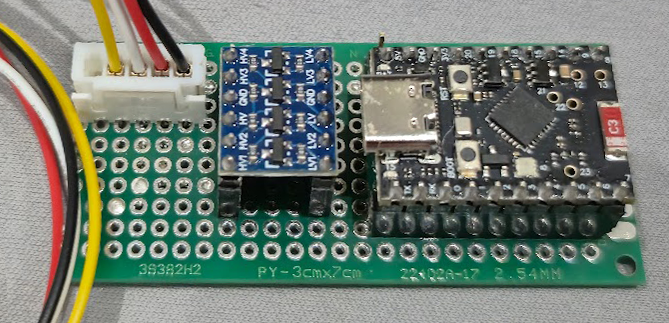
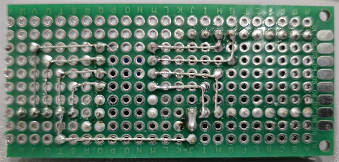

# ESP32 Heat Pump Control Board

This documentation describes how to build a **generic, replaceable, and maintainable ESP32-based control board** for air conditioners and heat pumps. 
The goal is to provide a reusable hardware platform that can be adapted to different heat pump models while remaining easy to maintain and upgrade.

## Hardware Considerations

### ESP32 Version

Any ESP32 variant can be used **as long as it has at least 4 MB of flash memory**.

- **4 MB or more (recommended)**  
  - Supports OTA (Over-The-Air) firmware updates  
  - No need to physically connect the board for updates

- **2 MB flash (supported with limitations)**  
  - OTA updates are **not available**  
  - Firmware updates require connecting the ESP32 to a PC and flashing manually every time

> Recommendation: Always choose an ESP32 with **4 MB or more** to simplify maintenance.

### Level Shifter (Mandatory)

Most heat pumps operate with **5V logic levels**, including GPIO signals.

The ESP32 uses **3.3V logic**.  
Connecting ESP32 pins directly to a 5V system will **very likely damage the ESP32**.

✔ A **logic level shifter is mandatory**  
✔ Use a **bi-directional level shifter module** to safely interface signals  
✔ Compact “all‑in‑one” modules are inexpensive and easy to integrate

### Antenna Placement

WiFi performance is highly sensitive to noise.

Best practices:
- Keep the ESP32 antenna **as far as possible** from:
  - Power supply components
  - Level shifters
- Place the antenna on the **opposite side** of noisy components

This layout significantly improves Wi‑Fi range and stability.

## Schematic

A jumper is provided to completely disconnect power from the ESP32.
This allows safe reflashing or debugging without injecting 5V signals into the heat pump during development.

## Board Pictures

### Top View

### Bottom View

## Tools Required

Basic electronics tools are sufficient:

- Soldering iron + solder wire
- Pliers / tweezers

## Bill of Materials (BOM)

| Component | Description | Link |
|---------|------------|------|
| ESP32-C6 Mini | Main microcontroller | https://fr.aliexpress.com/item/1005008653649948.html |
| Level Shifter | Logic level conversion (5V ↔ 3.3V) | https://fr.aliexpress.com/item/1005006823347058.html |
| PCB Board (FR4) | Prototyping PCB | https://fr.aliexpress.com/item/1005003647800709.html |
| 2.54 mm Pin Headers | Standard headers | https://fr.aliexpress.com/item/1005010347602299.html |
| 2.54 mm JST Connector (Male + Female) | External connections | https://fr.aliexpress.com/item/1005009087160808.html |
| Plastic Case (42×69×23 mm) | Optional enclosure (minimum 23 mm depth required) | https://fr.aliexpress.com/item/1005006900224809.html |
