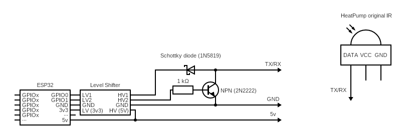

# Generic IR Mode

## Overview

This project explains how to convert a **non-connected heat pump** into a **connected device** by interfacing directly with its **infrared (IR) receiver**.

This procedure differnt from the Hardware_Generic_IR_Blaster.md one become it insert the ESP32 directly on the Air-Conditioner IR sensor.

The main advantage of this solution, it offer the most integrate solution where everything is hidden.
The main disadvantage is you need to open your air conditioner and solder directly on the IR sensor on the eletronic board, that might remove your warranty.

The core idea is to connect a **microcontroller (ESP32)** to the IR data line so it can:

- **Receive IR commands** coming from the original remote control  
- **Transmit IR commands** directly to the heat pump  

Unlike most IoT IR blasters that only *send* commands, this approach also **captures commands sent by the original remote**, giving you **true state feedback**. This ensures that the system always knows the real operating state of the heat pump, even when changes are made manually with the remote control.

## Key Advantages

- ✅ Bidirectional IR communication (send & receive)
- ✅ Accurate device state tracking
- ✅ Works with existing remote controls

## ⚠️ Important Safety Notes

This hardware design is provided **"AS IS"**, **without any warranty of any kind**.

Please read carefully before building:

- **⚠️ Never inject any voltage into the IR data pin**
- The circuit **only pulls the data pin down to GND**
- The provided schematic **must not drive the line high**

## Hardware Schematic

## Bill of Materials

| Component | Description | Link |
|---------|------------|------|
| ESP32 board | |  |
| 1Kohm Resistor | | https://fr.aliexpress.com/item/1005010228694988.html |
| 2N2222 | NPN Transistor | https://fr.aliexpress.com/item/1005001728337190.html |

## ESP32 Configuration

On the ESP32, you must select one GPIO for **IR receive (RX)** and one GPIO for **IR transmit (TX)**.

According to the provided schematic:

- **GPIO0 → IR RX**
- **GPIO1 → IR TX**
