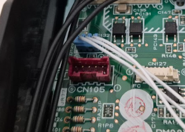
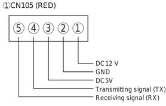
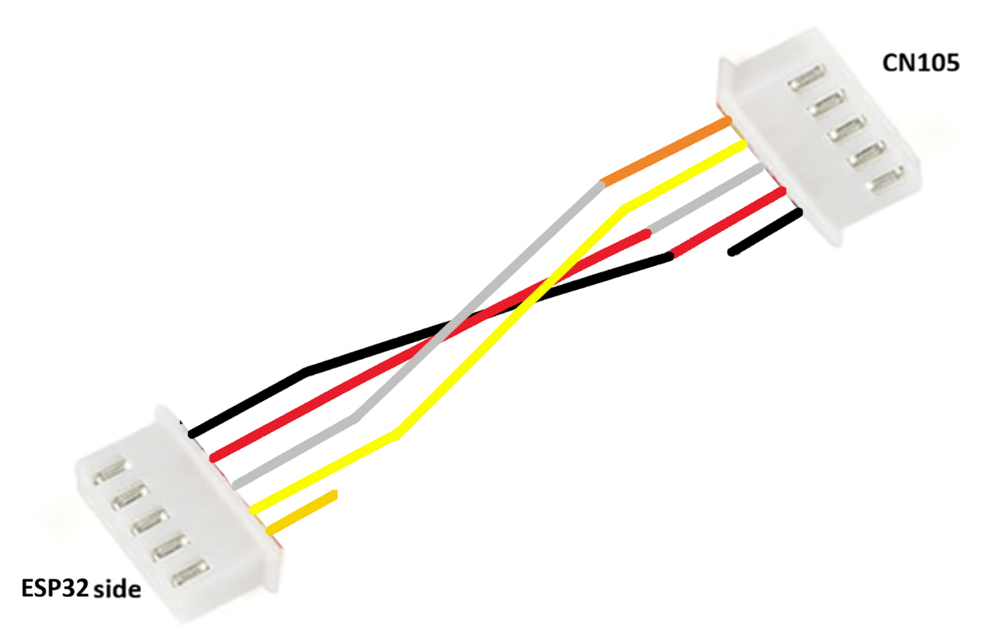
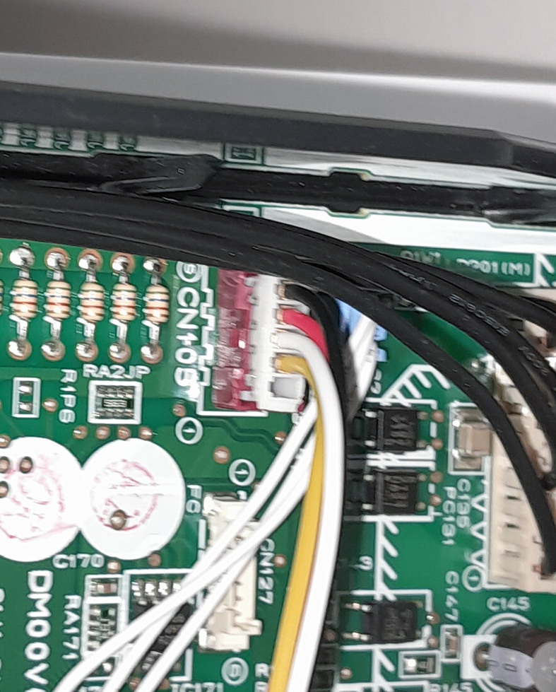

# Mitsubishi Heat Pump – CN105 Connector

## Overview

This document describes the **Mitsubishi heat pump CN105 connector**, its electrical characteristics, and the pinout used to interface with it. 
This connector is commonly used to communicate with Mitsubishi heat pumps for monitoring and control purposes.

## Communication Details

The CN105 connector exposes a **UART interface** with the following characteristics:

- **Logic level:** 5V TTL  
- **Baud rate:** 2400 bps  
- **Parity:** Even  
- **Data format:** 8E1 (8 data bits, even parity, 1 stop bit)

⚠️ **Note:** The ESP32 uses 3.3V logic. A level shifter is required to avoid damaging the ESP32.

## CN105 Connector

### Physical Connector

JST connector male 2.00mm (Red)

### Pinout

Make sure to double-check the pin numbering orientation before wiring.

## Bill of Materials (BOM)

| Component | Description | Link |
|---------|-------------|------|
| ESP32 board | |  |
| JST 2.00 mm Female Connector | Mating connector for CN105 | https://fr.aliexpress.com/item/1005009087160808.html |

---

## Adapter: JST 2.54 mm to JST 2.00 mm

## Connecting to an ESP32

For detailed ESP32 hardware setup refer to:

➡️ **[ESP32 Hardware Documentation](Hardware_ESP32.md)**
