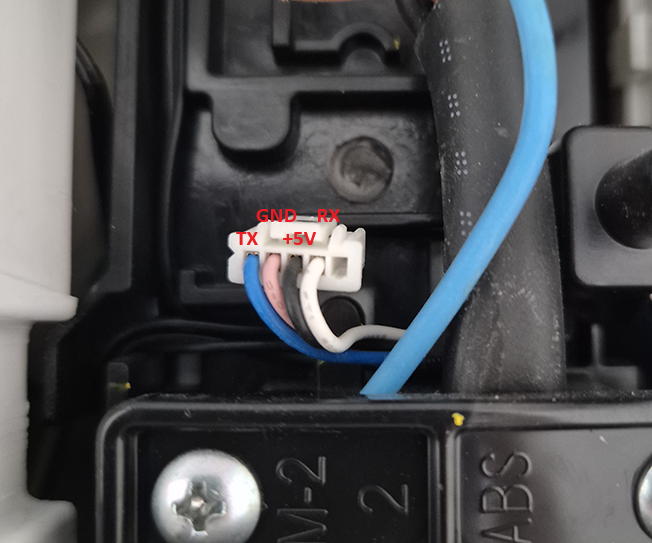
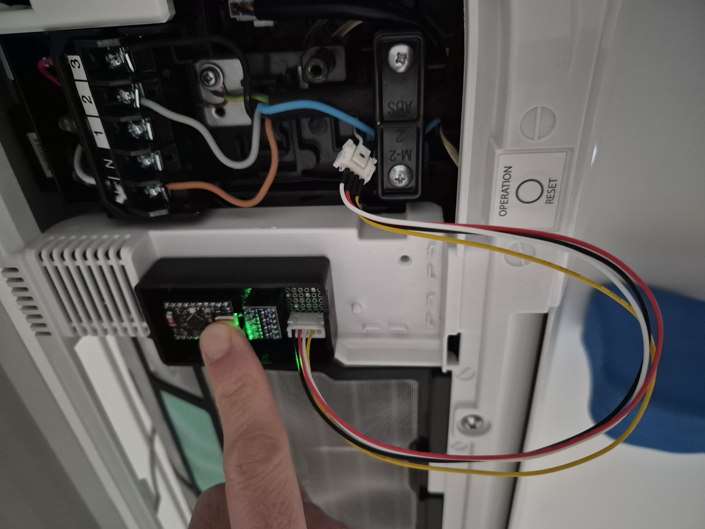
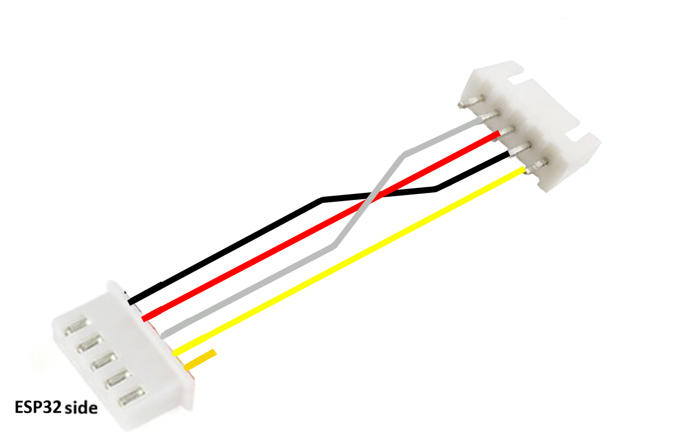

# Toshiba Heat Pump – Connector

## Overview

This page documents the **communication connector** used on **Toshiba heat pumps**.  
It describes the electrical characteristics, pinout, and how to interface the connector with an **ESP32**.
The connector exposes a simple UART interface.

## Communication Details

The connector provides a **UART (serial) interface** with the following parameters:

- **Logic level:** 5V TTL
- **Baud rate:** 9600 bps
- **Data format:** 8E1
  - 8 data bits  
  - Even parity  
  - 1 stop bit  

## Connector

### Physical Connector

- **Type:** JST female connector  
- **Pitch:** 2.00 mm   

### Pinout

| Pin | Wire Color | Signal | Description |
|-----|------------|--------|-------------|
| 1 | Blue | TX | UART transmit (from heat pump) |
| 2 | Pink | GND | Ground |
| 3 | Black | +5V | 5V power output |
| 4 | White | RX | UART receive (to heat pump) |
| 5 | — | — | Not connected |

## Bill of Materials (BOM)

| Component | Description | Link |
|----------|-------------|------|
| JST 2.00 mm Male Connector | CN105 mating connector | https://fr.aliexpress.com/item/1005009087160808.html |

## Adapter: JST 2.54 mm to JST 2.00 mm male

Wiring to apply between the 2.00 JST male and the 2.54 JST female.

## Connecting to an ESP32

Follow below schema to build your ESP32:

➡️ **[ESP32 Hardware Documentation](Hardware_ESP32.md)**
